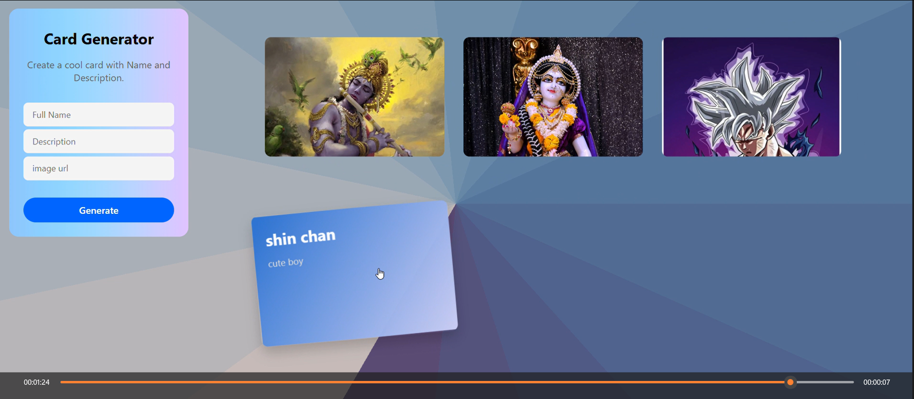

# **🎴 Card Generator - Create Stylish Profile Cards Instantly**

A simple and elegant **Card Generator Web App** that lets users create beautiful profile cards by entering a **Name**, **Description**, and **Image URL**.
Built with **HTML**, **CSS**, and **JavaScript**, the app renders interactive animated cards with real-time preview.

---

## 🚀 **Live Demo**

🔗 **Live Website:** [https://dileep-kumawat.github.io/card-generator-using-html-css-and-js/](https://dileep-kumawat.github.io/card-generator-using-html-css-and-js/)

---

## 🎥 **Demo Video**

📹 [click to watch](https://youtu.be/TMOzYCdKziE)

---

## 🖼️ **Project Preview**



---

# ✨ Features

* 📝 **Dynamic Card Creation** – Enter details and generate beautiful cards instantly
* 🖼️ **Image Support** – Add any image via URL
* 🎨 **Attractive UI** – Gradient backgrounds & smooth animations
* 🔄 **Multiple Cards** – Create unlimited cards in one session
* ⚡ **Fully Responsive**
* 🎯 **Vanilla JavaScript** – No libraries required

---

# 📂 Project Structure

```
📁 Card-Generator
 ├── index.html       # App UI
 ├── style.css        # Styling + Animations
 └── script.js        # Card generator logic
```

---

# 🛠️ Built With

* **HTML5**
* **CSS3**
* **JavaScript (ES6)**
* **Flexbox**
* **CSS Gradients & Transitions**

---

# 🚀 How It Works

1. Enter:

   * Name
   * Description
   * Image URL
2. Click **Generate**
3. A new animated card appears in the card section
4. Repeat to add multiple cards

---

# 📦 Installation (Local Setup)

```bash
# Clone the repository
git clone https://github.com/Dileep-kumawat/card-generator-using-html-css-and-js.git

# Navigate into the project
cd your-repo-name

# Open index.html in any browser
```

---

# 🤝 Contributing

Pull requests are welcome!
Feel free to fork this repo and submit improvements.

---

## 🧑‍💻 Author

👤 **Dileep kumawat**
- 📧 [dileepkumawat525@gmail.com](mailto:dileepkumawat525@gmail.com)
- 🔗 [LinkedIn](https://www.linkedin.com/in/dileep-kumawat/)

---

# 📜 License

This project is open-source - use it freely.